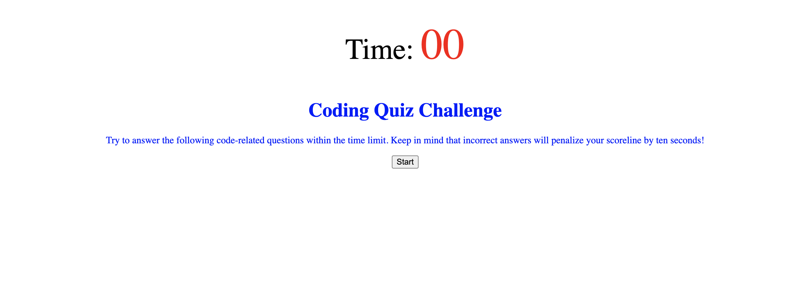

# Code-Quiz


[Updated Site](https://senaygebrat.github.io/Code-Quiz/)

# About Code Quiz

This is a timed code quiz that utilizes HTML, CSS, and JavaScript. There are a few questions for the user, and when incorrectly answered time will be taken off the clock.

# Code Snippet

```
document.getElementById("start").addEventListener("click", function(){
    document.getElementById("start-div").style.display = "none";
    document.getElementById("question-div").style.display = "block";
    // document.getElementById("initials-div").style.display = "none";
    document.getElementById("options-div").style.display = "block";
    document.getElementById("time").textContent = timeLeft
    document.getElementById("question").textContent = currQuestion
    document.getElementById("options").textContent = currOptions
```

# Author Links

[LinkedIn](https://www.linkedin.com/in/senay-gebrat-566b78250/)
[Github](https://github.com/senaygebrat)
